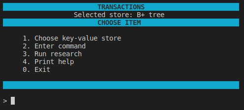
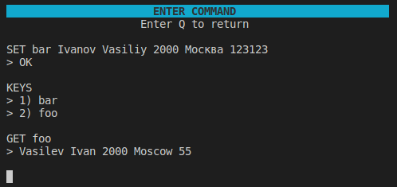
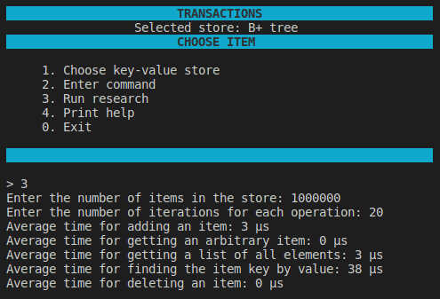

# Transactions v1.0
The "Transactions" is an app written in C++. The console application provides implementation of in-memory key-value store based on a hash table, self-balancing binary search tree and B+ tree.

#### Program launch options

```
make build
```

## Features
- Console interface

  

- Selection of the store type.
- Perform operations over store: insertion, searching, deletion, saving and other.

  

- Research on temporal characteristics over base operations.

  

## License
Copyright (c). All rights reserved.
